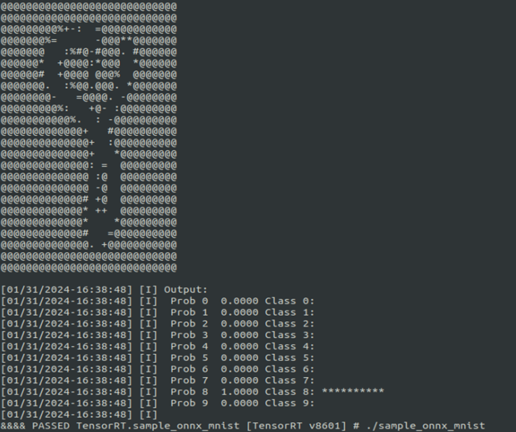
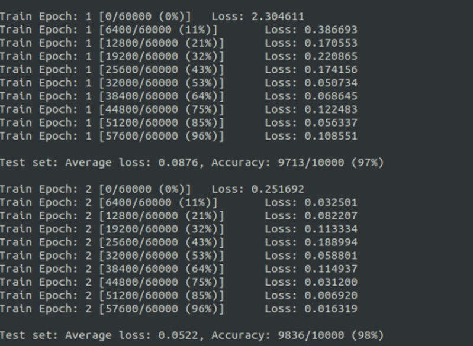

## installation
> example for:
> * RTX 3068 & Ubuntu 20.04
> * CUDA Toolkit 11.6 Update 2
> * TensorRT 8.6
> * python 3.10
### step-1: install CUDA-ToolKit 11.6 Update 2  
```bash
# 1-1: goto https://developer.nvidia.com/cuda-11-6-1-download-archive 
# download runfile and install by default (with nvidia driver same time)

# 1-2: set CUDA env
$ echo 'export PATH=$PATH:/usr/local/cuda/bin' >> ~/.bashrc
$ source ~/.bashrc

# 1-3: check cuda
$ nvidia-smi
$ nvcc -v
```
### step-2:  install TensorRT 8.6
```bash
# 2-1: goto https://developer.nvidia.com/nvidia-tensorrt-8x-download download tar file

# 2-2: unpack
$ sudo tar -xzvf TensorRT-8.6.1.6.Linux.x86_64-gnu.cuda-11.8.tar.gz -C /usr/local

# 2-3: set env
$ echo 'export PATH=$PATH:/usr/local/TensorRT-8.6.1.6/bin' >> ~/.bashrc
$ echo 'export LD_LIBRARY_PATH=$LD_LIBRARY_PATH:/usr/local/TensorRT-8.6.1.6/lib' >> ~/.bashrc
$ source ~/.bashrc

# 2-4: crate conda env
$ conda create -n tensorrt-helloworld python=3.10
$ conda activate tensorrt-helloworld

# 2-5: install python tool
$ cd /usr/local/TensorRT-8.6.1.6/python/ ; python3 -m pip install tensorrt-8.6.1-cp310-none-linux_x86_64.whl
$ cd /usr/local/TensorRT-8.6.1.6/graphsurgeon; python3 -m pip install graphsurgeon-0.4.6-py2.py3-none-any.whl
$ cd /usr/local/TensorRT-8.6.1.6/onnx_graphsurgeon; python3 -m pip install onnx_graphsurgeon-0.3.12-py2.py3-none-any.whl
```

### step-3: run helloworld

#### 3-1: sampleOnnxMNIST 
```bash
# sampleOnnxMNIST
$ cd /usr/local/TensorRT-8.6.1.6/samples/sampleOnnxMNIST/
$ make
$ cd ../../bin
$ ./sample_onnx_mnist
```

#### 3-2: network_api_pytorch_mnist 
```bash
# network_api_pytorch_mnist
$ cd /usr/local/TensorRT-8.6.1.6/samples/python/network_api_pytorch_mnist
$ pip3 install –r requirements.txt
$ python sample.py
```

