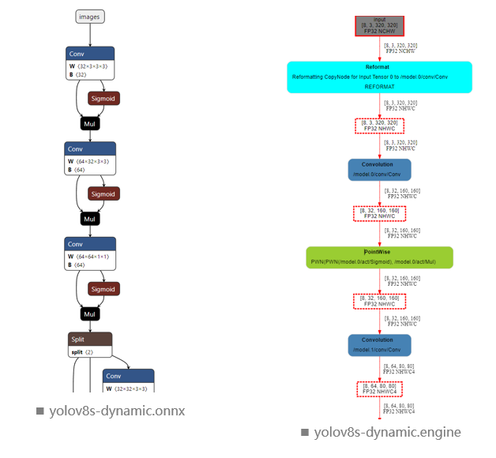
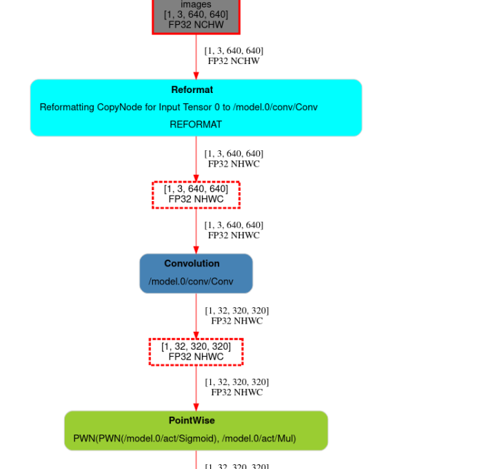
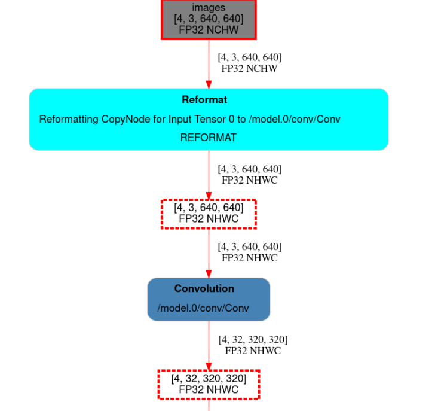

### installation
1. install tensorrt && yolov8
2. install TensorRT/tools/export
```shell
# step-1: clone the tensorrt repo.
$ git clone https://github.com/NVIDIA/TensorRT.git

# step-2: install the trex tool
$ cd TensorRT/tools/experimental/trt-engine-explorer
$ python3 -m pip install -e .
$ sudo apt-get --yes install graphviz
```

### onnx->engine (static input shape) 
<details close>
<summary>click to expand</summary>

#### export onnx
```bash
(yolov8-tensorrt) yzrt@MS7c90:~/workspace/yolov8-tensorrt-comp/trex-example$ yolo export model=yolov8s.pt format=onnx
Ultralytics YOLOv8.1.9 🚀 Python-3.10.13 torch-1.13.1 CPU (AMD Ryzen 9 5950X 16-Core Processor)
YOLOv8s summary (fused): 168 layers, 11156544 parameters, 0 gradients, 28.6 GFLOPs

PyTorch: starting from 'yolov8s.pt' with input shape (1, 3, 640, 640) BCHW and output shape(s) (1, 84, 8400) (21.5 MB)

ONNX: starting export with onnx 1.12.0 opset 16...
ONNX: export success ✅ 0.5s, saved as 'yolov8s.onnx' (42.8 MB)

Export complete (2.0s)
Results saved to /home/yzrt/workspace/yolov8-tensorrt-comp/trex-example
Predict:         yolo predict task=detect model=yolov8s.onnx imgsz=640  
Validate:        yolo val task=detect model=yolov8s.onnx imgsz=640 data=coco.yaml  
Visualize:       https://netron.app
💡 Learn more at https://docs.ultralytics.com/modes/export

```
#### convert to engine and show
```bash
(yolov8-tensorrt) yzrt@MS7c90:~/workspace/yolov8-tensorrt-comp/trex-example$ python ../TensorRT/tools/experimental/trt-engine-explorer/utils/process_engine.py yolov8s.onnx output
Building the engine:
trtexec --verbose --nvtxMode=verbose --buildOnly --workspace=8192 --onnx=yolov8s.onnx --saveEngine=output/yolov8s.onnx.engine --timingCacheFile=./timing.cache

Successfully built the engine.

Engine building metadata: generated output file output/yolov8s.onnx.engine.build.metadata.json
Profiling the engine:
trtexec --verbose --noDataTransfers --useCudaGraph --separateProfileRun --useSpinWait --nvtxMode=verbose --loadEngine=output/yolov8s.onnx.engine --exportTimes=output/yolov8s.onnx.engine.timing.json --exportProfile=output/yolov8s.onnx.engine.profile.json --exportLayerInfo=output/yolov8s.onnx.engine.graph.json --timingCacheFile=./timing.cache
WARNING:root:Could not lock clocks (Not Supported).
WARNING:root:Could not unlock clocks (Insufficient Permissions).
	Try running as root or unlocking the clocks from the commandline:
		sudo nvidia-smi --reset-gpu-clocks
		sudo nvidia-smi --reset-applications-clocks

Successfully profiled the engine.

Profiling metadata: generated output file output/yolov8s.onnx.engine.profile.metadata.json
Generating graph diagram: output/yolov8s.onnx.engine.graph.json
/home/yzrt/workspace/yolov8-tensorrt-comp/TensorRT/tools/experimental/trt-engine-explorer/trex/engine_plan.py:90: UserWarning:

Profiling data was not provided.

Created file:///home/yzrt/workspace/yolov8-tensorrt-comp/trex-example/output/yolov8s.onnx.engine.graph.json.svg
Artifcats directory: output

```
### svg


### test
```bash
(yolov8-tensorrt) yzrt@MS7c90:~/workspace/yolov8-tensorrt-comp/trex-example$ trtexec --loadEngine=output/yolov8s.onnx.engine
&&&& RUNNING TensorRT.trtexec [TensorRT v8601] # trtexec --loadEngine=output/yolov8s.onnx.engine
[02/06/2024-17:24:15] [I] === Model Options ===
[02/06/2024-17:24:15] [I] Format: *
[02/06/2024-17:24:15] [I] Model: 
[02/06/2024-17:24:15] [I] Output:
[02/06/2024-17:24:15] [I] === Build Options ===
[02/06/2024-17:24:15] [I] Max batch: 1
[02/06/2024-17:24:15] [I] Memory Pools: workspace: default, dlaSRAM: default, dlaLocalDRAM: default, dlaGlobalDRAM: default
## ...
[02/06/2024-17:24:19] [I] Average on 10 runs - GPU latency: 4.6447 ms - Host latency: 5.07073 ms (enqueue 0.809644 ms)
[02/06/2024-17:24:19] [I] Average on 10 runs - GPU latency: 4.64272 ms - Host latency: 5.06799 ms (enqueue 0.811743 ms)
[02/06/2024-17:24:19] [I] 
[02/06/2024-17:24:19] [I] === Performance summary ===
[02/06/2024-17:24:19] [I] Throughput: 215.68 qps
[02/06/2024-17:24:19] [I] Latency: min = 5.01874 ms, max = 5.21875 ms, mean = 5.06068 ms, median = 5.05786 ms, percentile(90%) = 5.09082 ms, percentile(95%) = 5.09766 ms, percentile(99%) = 5.10907 ms
[02/06/2024-17:24:19] [I] Enqueue Time: min = 0.511047 ms, max = 0.829834 ms, mean = 0.714372 ms, median = 0.653442 ms, percentile(90%) = 0.813721 ms, percentile(95%) = 0.818359 ms, percentile(99%) = 0.824219 ms
[02/06/2024-17:24:19] [I] H2D Latency: min = 0.269043 ms, max = 0.401001 ms, mean = 0.277233 ms, median = 0.276978 ms, percentile(90%) = 0.28418 ms, percentile(95%) = 0.285645 ms, percentile(99%) = 0.292419 ms
[02/06/2024-17:24:19] [I] GPU Compute Time: min = 4.59161 ms, max = 4.68684 ms, mean = 4.62722 ms, median = 4.62241 ms, percentile(90%) = 4.65601 ms, percentile(95%) = 4.6633 ms, percentile(99%) = 4.67355 ms
[02/06/2024-17:24:19] [I] D2H Latency: min = 0.1521 ms, max = 0.29303 ms, mean = 0.15623 ms, median = 0.154785 ms, percentile(90%) = 0.15918 ms, percentile(95%) = 0.16272 ms, percentile(99%) = 0.178711 ms
[02/06/2024-17:24:19] [I] Total Host Walltime: 3.01372 s
[02/06/2024-17:24:19] [I] Total GPU Compute Time: 3.0077 s
[02/06/2024-17:24:19] [I] Explanations of the performance metrics are printed in the verbose logs.
[02/06/2024-17:24:19] [I] 
&&&& PASSED TensorRT.trtexec [TensorRT v8601] # trtexec --loadEngine=output/yolov8s.onnx.engine
```


</details>

### onnx->engine (dynamic input shape) 
<details close>
<summary>click to expand</summary>

#### export onnx
```bash
(yolov8-tensorrt) yzrt@MS7c90:~/workspace/yolov8-tensorrt-comp/trex-example$ yolo export model=yolov8s.pt format=onnx dynamic=true
Ultralytics YOLOv8.1.9 🚀 Python-3.10.13 torch-1.13.1 CPU (AMD Ryzen 9 5950X 16-Core Processor)
YOLOv8s summary (fused): 168 layers, 11156544 parameters, 0 gradients, 28.6 GFLOPs

PyTorch: starting from 'yolov8s.pt' with input shape (1, 3, 640, 640) BCHW and output shape(s) (1, 84, 8400) (21.5 MB)

ONNX: starting export with onnx 1.12.0 opset 16...
ONNX: export success ✅ 0.6s, saved as 'yolov8s.onnx' (42.6 MB)

Export complete (2.1s)
Results saved to /home/yzrt/workspace/yolov8-tensorrt-comp/trex-example
Predict:         yolo predict task=detect model=yolov8s.onnx imgsz=640  
Validate:        yolo val task=detect model=yolov8s.onnx imgsz=640 data=coco.yaml  
Visualize:       https://netron.app
💡 Learn more at https://docs.ultralytics.com/modes/export


```
#### convert to engine and show
```bash
(yolov8-tensorrt) yzrt@MS7c90:~/workspace/yolov8-tensorrt-comp/trex-example$ python ../TensorRT/tools/experimental/trt-engine-explorer/utils/process_engine.py yolov8s.onnx output1 minShapes=images:1x3x640x640 optShapes=images:4x3x640x640 maxShapes=images:8x3x640x640
Building the engine:
trtexec --verbose --nvtxMode=verbose --buildOnly --workspace=8192 --onnx=yolov8s.onnx --saveEngine=output1/yolov8s.onnx.engine --timingCacheFile=./timing.cache --minShapes=images:1x3x640x640 --optShapes=images:4x3x640x640 --maxShapes=images:8x3x640x640

Successfully built the engine.

Engine building metadata: generated output file output1/yolov8s.onnx.engine.build.metadata.json
Profiling the engine:
trtexec --verbose --noDataTransfers --useCudaGraph --separateProfileRun --useSpinWait --nvtxMode=verbose --loadEngine=output1/yolov8s.onnx.engine --exportTimes=output1/yolov8s.onnx.engine.timing.json --exportProfile=output1/yolov8s.onnx.engine.profile.json --exportLayerInfo=output1/yolov8s.onnx.engine.graph.json --timingCacheFile=./timing.cache --minShapes=images:1x3x640x640 --optShapes=images:4x3x640x640 --maxShapes=images:8x3x640x640
WARNING:root:Could not lock clocks (Not Supported).
WARNING:root:Could not unlock clocks (Insufficient Permissions).
	Try running as root or unlocking the clocks from the commandline:
		sudo nvidia-smi --reset-gpu-clocks
		sudo nvidia-smi --reset-applications-clocks

Successfully profiled the engine.

Profiling metadata: generated output file output1/yolov8s.onnx.engine.profile.metadata.json
Generating graph diagram: output1/yolov8s.onnx.engine.graph.json
/home/yzrt/workspace/yolov8-tensorrt-comp/TensorRT/tools/experimental/trt-engine-explorer/trex/engine_plan.py:90: UserWarning:

Profiling data was not provided.

Created file:///home/yzrt/workspace/yolov8-tensorrt-comp/trex-example/output1/yolov8s.onnx.engine.graph.json.svg
Artifcats directory: output1


```
### svg


### test
```bash
(yolov8-tensorrt) yzrt@MS7c90:~/workspace/yolov8-tensorrt-comp/trex-example$ trtexec --loadEngine=output1/yolov8s.onnx.engine --shapes=images:2x3x640x640
&&&& RUNNING TensorRT.trtexec [TensorRT v8601] # trtexec --loadEngine=output1/yolov8s.onnx.engine --shapes=images:2x3x640x640
[02/06/2024-17:32:05] [I] === Model Options ===
[02/06/2024-17:32:05] [I] Format: *
[02/06/2024-17:32:05] [I] Model: 
[02/06/2024-17:32:05] [I] Output:
[02/06/2024-17:32:05] [I] === Build Options ===
[02/06/2024-17:32:05] [I] Max batch: explicit batch
[02/06/2024-17:32:05] [I] Memory Pools: workspace: default, dlaSRAM: default, dlaLocalDRAM: default, dlaGlobalDRAM: default
# ...
[02/06/2024-17:32:09] [I] Average on 10 runs - GPU latency: 8.58496 ms - Host latency: 9.42678 ms (enqueue 0.968872 ms)
[02/06/2024-17:32:09] [I] Average on 10 runs - GPU latency: 8.57859 ms - Host latency: 9.41812 ms (enqueue 0.964893 ms)
[02/06/2024-17:32:09] [I] 
[02/06/2024-17:32:09] [I] === Performance summary ===
[02/06/2024-17:32:09] [I] Throughput: 116.432 qps
[02/06/2024-17:32:09] [I] Latency: min = 9.39136 ms, max = 9.69873 ms, mean = 9.43979 ms, median = 9.4397 ms, percentile(90%) = 9.45776 ms, percentile(95%) = 9.46716 ms, percentile(99%) = 9.48938 ms
[02/06/2024-17:32:09] [I] Enqueue Time: min = 0.813904 ms, max = 1.0542 ms, mean = 0.976338 ms, median = 0.97345 ms, percentile(90%) = 1.00085 ms, percentile(95%) = 1.0271 ms, percentile(99%) = 1.04468 ms
[02/06/2024-17:32:09] [I] H2D Latency: min = 0.534668 ms, max = 0.812866 ms, mean = 0.553147 ms, median = 0.556458 ms, percentile(90%) = 0.561768 ms, percentile(95%) = 0.563721 ms, percentile(99%) = 0.572632 ms
[02/06/2024-17:32:09] [I] GPU Compute Time: min = 8.55542 ms, max = 8.62415 ms, mean = 8.58055 ms, median = 8.57849 ms, percentile(90%) = 8.59241 ms, percentile(95%) = 8.60278 ms, percentile(99%) = 8.61902 ms
[02/06/2024-17:32:09] [I] D2H Latency: min = 0.299072 ms, max = 0.352173 ms, mean = 0.306098 ms, median = 0.305298 ms, percentile(90%) = 0.308716 ms, percentile(95%) = 0.313416 ms, percentile(99%) = 0.323914 ms
[02/06/2024-17:32:09] [I] Total Host Walltime: 3.02322 s
[02/06/2024-17:32:09] [I] Total GPU Compute Time: 3.02035 s
[02/06/2024-17:32:09] [I] Explanations of the performance metrics are printed in the verbose logs.
[02/06/2024-17:32:09] [I] 
&&&& PASSED TensorRT.trtexec [TensorRT v8601] # trtexec --loadEngine=output1/yolov8s.onnx.engine --shapes=images:2x3x640x640

```

### wrong shape 
```bash
(yolov8-tensorrt) yzrt@MS7c90:~/workspace/yolov8-tensorrt-comp/trex-example$ trtexec --loadEngine=output1/yolov8s.onnx.engine --shapes=images:2x3x320x640 
&&&& RUNNING TensorRT.trtexec [TensorRT v8601] # trtexec --loadEngine=output1/yolov8s.onnx.engine --shapes=images:2x3x320x640
[02/06/2024-17:33:19] [I] === Model Options ===
[02/06/2024-17:33:19] [I] Format: *
[02/06/2024-17:33:19] [I] Model: 
[02/06/2024-17:33:19] [I] Output:
[02/06/2024-17:33:19] [I] === Build Options ===
[02/06/2024-17:33:19] [I] Max batch: explicit batch
# ...
[02/06/2024-17:33:20] [I] Setting persistentCacheLimit to 0 bytes.
[02/06/2024-17:33:20] [E] Error[3]: [executionContext.cpp::setInputShape::2264] Error Code 3: API Usage Error (Parameter check failed at: runtime/api/executionContext.cpp::setInputShape::2264, condition: engineDims.d[i] == dims.d[i]. Static dimension mismatch while setting input shape.
)
[02/06/2024-17:33:20] [E] Inference set up failed
&&&& FAILED TensorRT.trtexec [TensorRT v8601] # trtexec --loadEngine=output1/yolov8s.onnx.engine --shapes=images:2x3x320x640
```

</details>